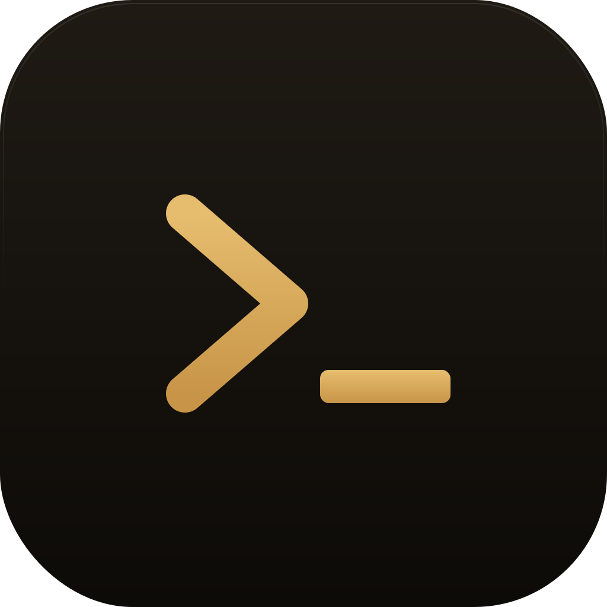

<div align="center">
  

  # mTerminal

  A modern, multi-tab terminal emulator for Linux, Windows, and macOS.

  [](LICENSE)
  [](https://www.electronjs.org)
  [](https://www.typescriptlang.org)
  [](https://github.com/arthurr0/mTerminal/releases)

  [Install](#install) · [Build](#build-from-source) · [Docs](CLAUDE.md) · [Releases](https://github.com/arthurr0/mTerminal/releases)
</div>

---

## Features

- **Real PTY sessions** via [`node-pty`](https://github.com/microsoft/node-pty) — ConPTY on Windows, login shell on Linux/macOS.
- **Multi-tab + tab groups** — drag-and-drop, inline rename, accent palette, live labels from `cwd` and running command.
- **Encrypted credential vault** — XChaCha20-Poly1305 + Argon2id. Master password never leaves the device.
- **AI integration** — Anthropic, OpenAI, Ollama. Command palette, side-panel chat, explain-selection, one-shot Claude Code tab.
- **MCP server** — JSON-RPC over Unix domain socket, exposing `list_tabs`, `get_output`, `send_keys` to local agents.
- **Extensions** — first-party SSH/SFTP, file browser, git panel, error linkifier, theme pack. Typed [`@mterminal/extension-api`](packages/extension-api).
- **Themes** — 6 built-in + extra theme pack.
- **Persistent workspace** — tabs, groups, names, accents survive restart.

> **Status:** alpha. Tested on Linux (X11 + Wayland), Windows 10/11, macOS 14+.

## Install

### Linux

```bash
git clone https://github.com/arthurr0/mTerminal.git
cd mTerminal
./install.sh                # ~/.local/bin (default)
./install.sh --system       # /usr/local (sudo)
./install.sh --uninstall
```

Or grab `.AppImage` / `.deb` from [Releases](https://github.com/arthurr0/mTerminal/releases).

**Arch / CachyOS (AUR):**

```bash
yay -S mterminal-bin
```

### Windows

```powershell
git clone https://github.com/arthurr0/mTerminal.git
cd mTerminal
pwsh -File .\install.ps1                # per-user
pwsh -File .\install.ps1 -Mode System   # system-wide (UAC)
pwsh -File .\install.ps1 -Uninstall
```

Or download `mTerminal-<version>-setup.exe` (NSIS, no admin) from Releases.

### macOS

Universal DMG from [Releases](https://github.com/arthurr0/mTerminal/releases). Builds are **unsigned** — on first run:

```bash
xattr -cr /Applications/mTerminal.app
```

Or right-click `.app` → **Open** → **Open** in the Gatekeeper dialog.

## Keyboard shortcuts

`Ctrl` on Linux/Windows, `Cmd` on macOS.

| Shortcut | Action |
|---|---|
| `Ctrl+T` / `Ctrl+W` | New tab / close tab |
| `Ctrl+1` … `Ctrl+9` | Switch to tab N |
| `Ctrl+Shift+G` | New group |
| `Ctrl+Shift+P` / `Ctrl+Shift+A` | AI palette / side panel |
| `Ctrl+Shift+L` | New Claude Code tab |
| `Ctrl+,` / `Ctrl+B` | Settings / toggle sidebar |

## Build from source

**Requirements:** Node.js 20+, pnpm 9+, platform C/C++ toolchain (for `node-pty`).

| OS | Packages |
|---|---|
| Arch / CachyOS | `nodejs pnpm base-devel python` |
| Debian / Ubuntu | `nodejs build-essential python3` + `pnpm` via Corepack |
| Fedora | `nodejs @"C Development Tools and Libraries" python3` |
| macOS | `xcode-select --install` |
| Windows | MSVC C++ Build Tools |

```bash
pnpm install
pnpm exec electron-rebuild -f -w node-pty   # rebuild against Electron ABI
pnpm dev                                    # HMR dev server
```

**Package:**

```bash
pnpm package:linux    # AppImage + deb  → release/
pnpm package:win      # NSIS installer  → release/
pnpm package:mac      # universal DMG   → release/
```

**Test:**

```bash
pnpm test
pnpm typecheck
```

> Always use `pnpm exec electron-rebuild` (not `pnpm rebuild`) for `node-pty` after install or Electron upgrade. The npm built-in targets the host Node ABI, not Electron's.

## Configuration

**Shell selection:**

| Platform | Resolution order |
|---|---|
| Linux / macOS | `/etc/passwd` field 7 → `$SHELL` → `/bin/bash` |
| Windows | `MTERMINAL_SHELL` → `pwsh.exe` → `powershell.exe` → `%COMSPEC%` → `cmd.exe` |

**Environment injected into spawned shells:** `TERM=xterm-256color`, `COLORTERM=truecolor`, `MTERMINAL=1`. Detect in your shell rc:

```sh
if [ -n "$MTERMINAL" ]; then
    # mTerminal-specific setup
fi
```

**Storage:**

| Data | Location |
|---|---|
| Workspace, settings | `localStorage` |
| Hosts (no secrets) | `<config-dir>/mterminal/hosts.json` |
| Encrypted vault | `<config-dir>/mterminal/vault.bin` |
| MCP socket | `$XDG_RUNTIME_DIR/mterminal-mcp-$USER.sock` (Linux), `~/Library/Caches/mterminal/mcp-<user>.sock` (macOS) |

## Architecture

```
┌────────────────────────────┐        ┌──────────────────────────────┐
│      Renderer (React)      │  IPC   │       Main (Node.js)         │
│  xterm.js · workspace      │ ◀────▶ │   node-pty · MCP · vault     │
│  settings · extension UI   │ events │   AI providers · extensions  │
└────────────────────────────┘        └──────────────────────────────┘
```

Deep dive in [`CLAUDE.md`](CLAUDE.md).

## Contributing

Issues and PRs welcome. Run `pnpm test && pnpm typecheck` before opening a PR.

Commits follow [Conventional Commits](https://www.conventionalcommits.org/) — release notes are generated by [`git-cliff`](https://git-cliff.org/) from tags.

## License

[MIT](LICENSE)
